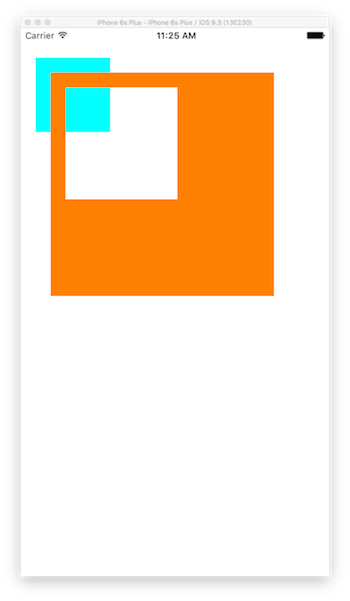

# FillRuleTest
The project to make sure of FillRule.

このプロジェクトはCAShapeLayerを用いたfillRuleの動作を確認するためのプロジェクトです。
fillRuleに関する解説はコチラ。

[【iOS】CAShapeLayerの二つのfillRuleの違い（修正版） ｜ Developers\.IO](http://dev.classmethod.jp/smartphone/iphone/fixed-cashapelayer-difference-of-two-fillrule/)

実行するとこんな感じで、fillRuleを使って前面にあるViewに描画しない領域をつくり、後ろ側にあるViewが見えるという状態を作っています。

